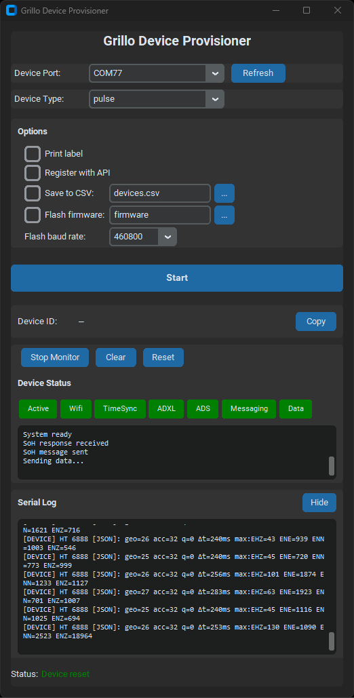

# Grillo Device Provisioner

Reads MAC addresses from ESP32 devices. Optionally registers with API, saves to CSV, and prints labels.

## Quick Start

```bash
pip install esptool pyserial
python esp32_device_reader.py
```

## GUI



```bash
pip install customtkinter  # Optional: for modern dark theme
python esp32_device_reader_gui.py
```
Or double-click `run_gui.bat` (Windows).

Features:
- Read device ID (MAC address)
- Print label, register with API, save to CSV
- Flash firmware with device type selection
- Serial monitor to view device output
- Auto-detects new devices on port refresh

## Usage

```bash
python esp32_device_reader.py [OPTIONS] [port]
```

| Flag | Description |
|------|-------------|
| `-p` | Print label (requires labelle + DYMO printer) |
| `-r` | Register with API |
| `-c [FILE]` | Save to CSV (default: devices.csv) |
| `-f [DIR]` | Flash firmware from directory (default: firmware/) |
| `-d TYPE` | Device type: `pulse` or `one` (default: pulse) |

## Platform Setup

### Windows

1. Install Python dependencies:
   ```bash
   pip install esptool pyserial requests
   ```

2. Install USB driver if needed:
   - [CP210x driver](https://www.silabs.com/developers/usb-to-uart-bridge-vcp-drivers)
   - [CH340 driver](http://www.wch-ic.com/downloads/CH341SER_ZIP.html)

3. For label printing, install labelle and use [Zadig](https://zadig.akeo.ie/) to set DYMO driver to WinUSB

### Linux

```bash
pip install esptool pyserial requests

# Add user to dialout group for serial access
sudo usermod -a -G dialout $USER
# Log out and back in

# For label printing
pip install labelle
```

### macOS

```bash
pip install esptool pyserial requests

# For label printing
pip install labelle
```

## Firmware Flashing

### Device Types

| Device | Chip | Flash Size | App Offset | Firmware File |
|--------|------|------------|------------|---------------|
| Pulse  | ESP32-S3 | 16MB | 0x20000 | grillo-pulse-firmware.bin |
| One    | ESP32 | 8MB | 0x20000 | grillo-one-firmware.bin |

### Option 1: Merged Binary (Recommended)

Place a single merged binary in `firmware/`:
```
firmware/
└── merged_firmware.bin
```

Generate merged binary for **Pulse** (16MB):
```bash
esptool.py --chip esp32s3 merge_bin -o firmware/merged_firmware.bin \
  --flash_mode dio --flash_size 16MB \
  0x0 build/bootloader/bootloader.bin \
  0x8000 build/partition_table/partition-table.bin \
  0x20000 build/grillo-pulse-firmware.bin
```

Generate merged binary for **One** (8MB):
```bash
esptool.py --chip esp32 merge_bin -o firmware/merged_firmware.bin \
  --flash_mode dio --flash_size 8MB \
  0x0 build/bootloader/bootloader.bin \
  0x8000 build/partition_table/partition-table.bin \
  0x20000 build/grillo-one-firmware.bin
```

### Option 2: Individual Files

Place individual files in the firmware directory:
```
firmware/
├── bootloader.bin          (Pulse: 0x0, One: 0x1000)
├── partition-table.bin     (0x8000)
└── grillo-pulse-firmware.bin or grillo-one-firmware.bin (0x20000)
```

**Note:** ESP32-S3 (Pulse) bootloader goes at 0x0, ESP32 (One) bootloader goes at 0x1000.

### Flash Command

```bash
python esp32_device_reader.py -f                    # Flash Pulse (default)
python esp32_device_reader.py -f -d one             # Flash One
```

After flashing, serial output is shown for 10 seconds.
